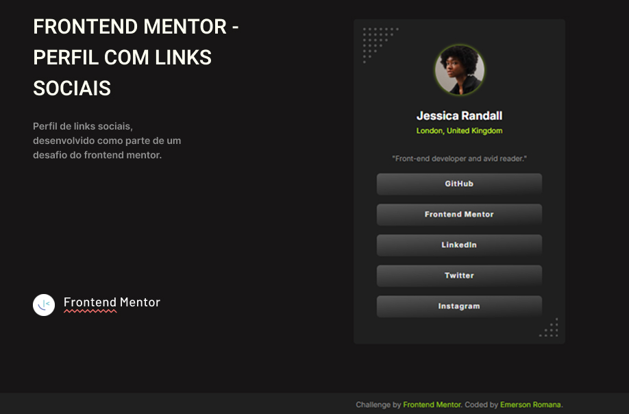

# Frontend Mentor - Perfil com links sociais



# Social Links Profile

Este é um projeto de perfil de links sociais, desenvolvido como parte de um desafio do Frontend Mentor. Ele é uma página simples, responsiva e com foco em acessibilidade, que lista links para diferentes plataformas sociais.

Acesse a página online: [Link para a Página](https://emersonromana.github.io/links-profile-FrontMentor/)


## Funcionalidades

- **Design Responsivo:** A página se adapta a diferentes tamanhos de tela, proporcionando uma ótima experiência em dispositivos móveis e desktops.
- **Botões Interativos:** Os botões de link possuem um efeito de hover que muda a cor do fundo e do texto, indicando interatividade.
- **Acessibilidade:** O projeto foi desenvolvido com foco em boas práticas de acessibilidade para garantir que seja utilizável por todos.
- **Estrutura Simples e Limpa:** O código HTML e CSS é organizado e fácil de entender.

## Tecnologias Usadas

- **HTML5:** Para a estrutura da página.
- **CSS3:** Para a estilização e responsividade.
  - **Flexbox:** Utilizado para o alinhamento e distribuição dos elementos.
  - **Custom Properties (Variáveis CSS):** Para manter a consistência e facilitar a manutenção das cores e fontes.

## Como Executar o Projeto

1.  **Clone o repositório:**
    ```bash
    git clone [https://github.com/seu-usuario/seu-repositorio.git](https://github.com/seu-usuario/seu-repositorio.git)
    ```
2.  **Navegue até o diretório do projeto:**
    ```bash
    cd seu-repositorio
    ```
3.  Abra o arquivo `index.html` em seu navegador de preferência para ver o projeto.

## Desafio do Frontend Mentor

Este projeto é uma solução para o desafio [Social Links Profile](https://www.frontendmentor.io/learning-paths/getting-started-on-frontend-mentor-XJhRWRREZd) no Frontend Mentor. Os desafios do Frontend Mentor ajudam a melhorar as habilidades de codificação criando projetos realistas a partir de designs.

## Autor

- **Nome:** Emerson Romana
- **GitHub:** [https://github.com/EmersonRomana](https://github.com/EmersonRomana)
- **Frontend Mentor:** [https://www.frontendmentor.io/profile/seu-usuario](https://www.frontendmentor.io/profile/EmersonRomana)

## Licença

Este projeto é de código aberto e está disponível sob a Licença MIT.
